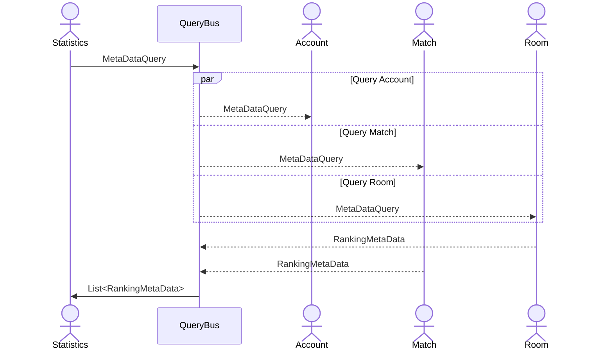

```mermaid
sequenceDiagram
  actor S as Statistics
  participant Q as QueryBus
  actor A as Account
  actor M as Match
  actor R as Room
  S->>Q: MetaDataQuery
  par Query Account
    Q-->>A: MetaDataQuery
  and Query Match
    Q-->>M: MetaDataQuery
  and Query Room
    Q-->>R: MetaDataQuery
  end
  R-->>Q: RankingMetaData
  M-->>Q: RankingMetaData
  Q->>S: List<RankingMetaData>
```
