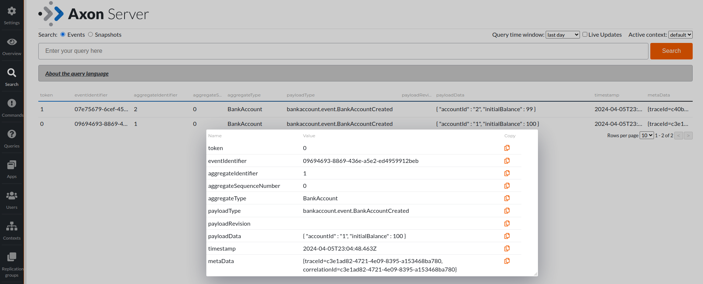

## Axon Server Plugin

### How to run
1. Build (`mvn clean package`)
2. Start `BankTestApplication` with `axon-server` Spring profile
3. Run AxonServer
4. Open [Server Dashboard](http://localhost:8024/)
5. Open [Plugins Tab](http://localhost:8024/#plugins)
6. Upload the JAR file from ./serializer/server-plugin/target/
7. Edit properties: for AxonServer set the `Registry URL template` to `http://host.docker.internal:8080/rest/schema/{fingerprint}`
8. Open [Query Tab](http://localhost:8024/#query), search for events

